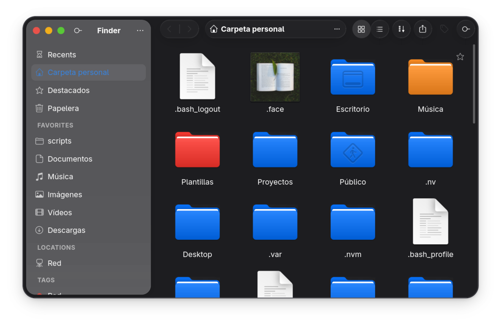

# Finder (Pulsar OS Files)



Finder es el explorador de archivos oficial de **Pulsar OS**, derivado de GNOME Files (Nautilus) y modificado bajo la misma licencia **GPL-3.0**. Este derivado añade un aspecto visual y funcional inspirado en macOS, incluyendo etiquetas de colores para carpetas y archivos, y un diseño unificado y minimalista.

## Características principales

* **Diseño macOS**: Esquinas redondeadas, controles integrados y una barra de herramientas limpia.
* **Etiquetas por colores**: Tintado de carpetas en tiempo real con filtrado dedicado por color en la barra lateral.
* **Navegación Fluida**: Rápido refresco de vistas al actualizar propiedades o etiquetas.

---

## Cómo construir

Este proyecto utiliza el sistema de construcción `meson` y `ninja`.

### Requisitos previos

Asegúrate de instalar las herramientas de compilación y las dependencias de desarrollo de GTK4, Libadwaita y Tracker.

### Pasos de compilación

1. **Configurar el directorio de construcción**:
   ```bash
   meson setup _build
   ```

2. **Compilar el proyecto**:
   ```bash
   ninja -C _build
   ```

---

## Cómo probar

Puedes ejecutar la versión compilada directamente sin alterar el sistema:

```bash
./_build/src/nautilus --new-window
```

---

## Cómo instalar

Para instalar la aplicación en el sistema (requiere permisos de administrador):

```bash
sudo ninja -C _build install
```

O utilizando `pkexec`:

```bash
pkexec ninja -C _build install
```
